# Plan&Go

> **By Team TungTungSahur**  
> **Problem Statement:** Travel Planner  
> **Team Members:** Lee Xhi Rou, Bernice Tan Jiawen, Kam Xin Le, Yap En Yu  
> 
> 🔗 **Quick Links:**
> - 🎥 **Video Presentation:** [Watch Unlisted YouTube Video]([Unlisted Youtube Link])
> - 📊 **Presentation Slides:** [View Slides]([Public Link])
> - 🌐 **Live Prototype:** [https://plan-and-go-v1.vercel.app/](https://plan-and-go-v1.vercel.app/)

---

## 1. Project Overview

### 1.1 The Problem
We chose to focus on group travel because travelling with multiple people often creates more challenges. Different travellers may have different budgets, interests, schedules, and preferred travel paces, making it difficult to create a plan that works for everyone. Unexpected changes such as bad weather, transportation delays, budget changes, or changing preferences can further disrupt the original itinerary.

Existing travel applications address some of these problems, but they often focus on specific parts of the travel experience. For example, **Wanderlog** supports collaborative itinerary planning, budgeting, expense splitting, and travel organization, while **TripIt** focuses on consolidating bookings and managing travel itineraries. However, existing solutions rarely bring group preference coordination, real-time adaptive planning, comprehensive traveller safety, and integrated expense tracking together into a single platform.

This creates an opportunity for **Plan&Go** to provide a more adaptive and integrated travel experience — helping groups make decisions together, automatically adjust plans when situations change, and providing additional safety support for women and other travellers.

### 1.2 The Solution
**Plan&Go** is an AI-powered travel companion designed to make group trips seamless, safe, and truly memorable. Before you even set off, it takes the hassle out of preparation with smart packing lists and weather-matched outfit recommendations.

On the road, Plan&Go balances everyone’s budget, pace, and interests into a flexible itinerary that adapts automatically to unexpected changes like bad weather or transit delays. More than just a logistics tool, it acts as an interactive travel journal with built-in safety support and smart expense sharing—keeping everyone protected while preserving your shared memories for years to come.

### 1.3 Feature Set

| Feature | Description |
| :--- | :--- |
| **AI-Powered Smart Planning** | Turn “Where should we go?” into a ready-to-go adventure. Plan&Go creates personalized itineraries based on your budget, available time, starting location, travel style, transport preferences, and who you’re travelling with. For group trips, everyone’s preferences are considered to create a plan that works for the whole group. |
| **One-Click Adaptive Itinerary** | Your itinerary isn’t set in stone. Regenerate your plan instantly when something doesn’t feel right. Tell Plan&Go why you want to change it, remove places you dislike, add your own bucket-list destinations, or discover nearby alternatives—so every regeneration gets closer to your ideal trip. |
| **Weather-Aware Planning** | Plan for the trip you’ll actually experience. Integrated weather forecasts help travellers anticipate changing conditions and prepare accordingly, making it easier to adjust activities and avoid unpleasant surprises. |
| **Integrated Flight & Stay Booking** | From planning to booking, without jumping between apps. Search and book flights and accommodations directly within Plan&Go, bringing essential travel planning activities together in one seamless experience. |
| **Smart Expense Tracking** | Know where your group’s money is going. Record shared expenses, track who paid, calculate settlements, and monitor your remaining trip budget in real time. Plan&Go can also alert the group when spending approaches or exceeds the planned budget. |
| **AI Bill Splitting** | Turn a messy receipt into a fair split in seconds. Upload a receipt and Plan&Go extracts the individual items, allowing each traveller to select what they purchased before automatically calculating how much everyone owes. Manual entry is also available when there’s no receipt. |
| **One-Tap Travel Guardian** | When something goes wrong, help is only one tap away. Travellers can trigger an SOS that shares their live location with relevant local authorities, helping reduce the friction of getting assistance during an emergency. |
| **Live Location Circle** | Stay connected without constantly asking “Where are you?” Share your live location with trusted group members or emergency contacts and view relevant locations on an interactive map—helping groups stay together and making it easier to find one another. |
| **AI Travel Stylist** | Let AI answer the “What should I wear?” question. Plan&Go recommends outfits based on the destination and expected weather, helping travellers choose what to wear without overthinking every day of the trip. |
| **Smart Packing List** | Pack smarter, not heavier. Plan&Go generates a practical packing checklist based on your trip, helping you remember the essentials. Tick items off as you pack and enjoy a more effortless preparation process. |
| **Travel Footprint** | Turn your journey into a map of memories. Capture the places you’ve visited by attaching your own photos to locations on the map, creating a personalized visual footprint of your journey over time. |
| **Daily Travel Journal** | Don’t just plan your trip—live and remember it. At the end of each day, travellers can check in with their emotions, write personal notes, and capture what made the day exciting, meaningful, difficult, or memorable. |
| **Trip Harmony Score** | Measure how the journey felt—not just where you went. Plan&Go transforms daily check-ins and trip reflections into a personalized Harmony Score, giving groups a unique reflection of their overall travel experience. The final summary can be exported as a shareable PNG for social media. |

---

## 2. Ideation & Process (Evaluation Weightage: 25%)

### 2.1 Ideas We Considered

| Idea | Status | Why it was dropped / kept |
| :--- | :---: | :--- |
| **AI-Powered Smart Planning** | **Chosen** | This was selected as the main planning idea because it provides a personalised starting point for different types of travellers. |
| **One-Click Adaptive Itinerary** | **Chosen** | We chose this idea because travel plans may change during a trip. It makes the system more flexible instead of giving users only one fixed plan. |
| **Weather-Aware Planning** | **Chosen** | We kept this idea because weather can affect outdoor activities and the overall travel experience. |
| **Integrated Flight & Stay Booking** | **Chosen** | We selected this idea to reduce the need for users to switch between different platforms when arranging their trip. |
| **In-App Share Wallet** | **Dropped** | We initially planned to include an e-wallet where travel partners could transfer and use their trip budget within the app. However, implementing financial transactions within a short development period was not feasible. We were also concerned about financial security, which we could not confidently guarantee with our current resources and skills. Therefore, we decided to drop this feature. |
| **Smart Expense Tracking** | **Chosen** | We chose this idea because managing group spending can be difficult, especially when several people share expenses. |
| **AI Bill Splitting** | **Chosen** | We kept this idea because splitting expenses manually can be time-consuming and may cause mistakes or disagreements between travellers. |
| **One-Tap Travel Guardian** | **Chosen** | We selected this idea because safety is a major concern when travelling, especially when users need help quickly during an emergency. |
| **Live Location Navigation** | **Dropped** | We initially planned to use the traveller’s live location to suggest routes to their destinations, mainly through walking or public transportation such as buses. For walking routes, the app would also display the traveller’s live location while they were travelling. However, we decided to drop this idea because continuously collecting and displaying users’ real-time location could create privacy and security concerns. It would also require more complex location services and real-time tracking, making it less feasible to implement reliably within our limited development time and resources. |
| **Real-Time Public Transportation Tracker** | **Dropped** | We initially planned to provide real-time tracking for buses, MRT, and LRT, including estimated arrival times, future schedules, and notifications when a service was delayed or cancelled. However, we decided to drop this idea because we did not have sufficient access to reliable and real-time public transportation data. Accurate delay and cancellation information would require data from transportation operators or reliable real-time APIs, which were not readily available to us. Without a consistent data source, the information shown by the app could be inaccurate and potentially cause users to miss their transportation. Therefore, this feature was considered too difficult and unreliable to implement within our development time and resources. |
| **Live Location Circle** | **Chosen** | We chose this idea because it helps travelling groups stay connected and makes it easier to know where group members are. |
| **AI Travel Stylist** | **Chosen** | We kept this idea because choosing suitable clothes can be inconvenient when travellers need to consider different destinations and weather conditions. |
| **Smart Packing List** | **Chosen** | This idea was selected because travellers may forget important items when preparing for a trip. |
| **Travel Footprint** | **Chosen** | We kept this idea because it adds a personal and memorable aspect to the travel experience by allowing users to record their journey. |
| **Daily Travel Journal** | **Chosen** | This idea was selected because it allows travellers to record their experiences and emotions instead of focusing only on practical trip planning. |
| **Trip Harmony Score** | **Chosen** | We chose this idea because it provides a way for travellers to reflect on their overall group experience after the trip. |

### 2.2 Ideation Boards

#### Mindmap 1 – Initial Concept
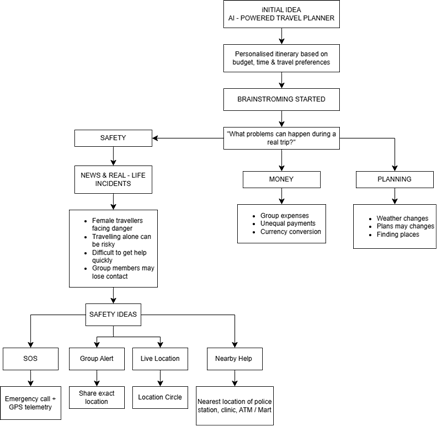

#### Mindmap 2 – Idea Development
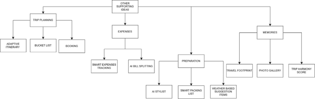

#### Mindmap 3 – Refined Concept After Mentor Consultation
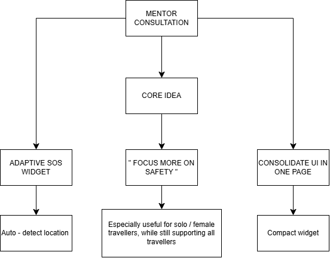

### 2.3 Mentor Consultation

| Date | Mentor | Feedback Received | What Was Changed |
| :--- | :--- | :--- | :--- |
| **9/9/2026** | **Zach Thong** | 1. **Focus on Safety:** Centre the app on user safety (especially women, kids, and teens) rather than just group travel planning. 2. **Consolidate UI on One Page:** Put all key entry points on a single dashboard using small widgets so users can easily follow. 3. **Adaptive SOS Widget:** Add an SOS button widget with auto-location detection adaptable anywhere. 4. **Direct Booking via APIs & Agents:** Move beyond passive recommendations—call agents and integrate APIs (e.g., Trip.com) to book flights directly, linked with the wallet. | 1. **Repositioned Core Concept:** Shifted to a safety-first platform with built-in safeguards for solo and female travellers across 6 core features. 2. **Single-Page Widget Dashboard:** Redesigned the homepage into a unified dashboard featuring compact widgets to showcase all key features and live recommendations at once. 3. **Real-Time SOS Widget:** Added a persistent SOS button that auto-detects current coordinates to access local emergency help globally. |

---

## 3. Design & Prototype

> 🌐 **Interactive Prototype URL:** [https://plan-and-go-v1.vercel.app/](https://plan-and-go-v1.vercel.app/)

### Figure 1: Preferences
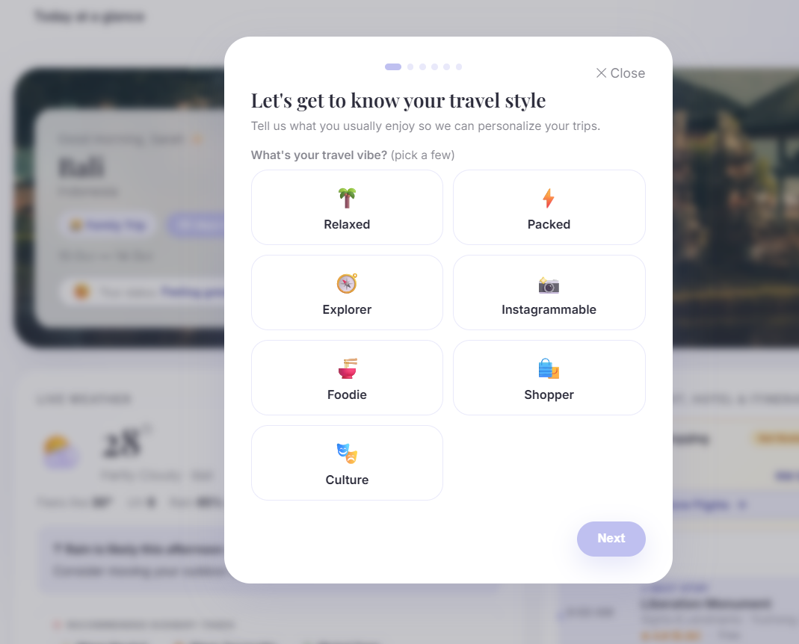  
*Users customize their travel preferences by selecting from diverse travel vibes such as relaxed, foodie, or packed. These inputs directly feed into the recommendation engine to tailor hyper-personalized itineraries and activities.*

### Figure 2: Itinerary Planning
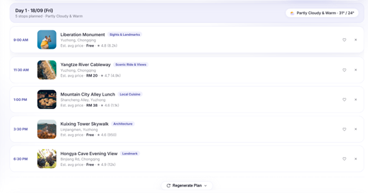  
*The platform generates a fully customized daily itinerary structured with real-time weather, curated stops, estimated costs, and timing. Users can easily fine-tune their schedule by bookmarking, removing stops, or triggering a one-click "Regenerate Plan" to refresh recommendations.*

### Figure 3: AI Smart Receipt Split & Expense Management
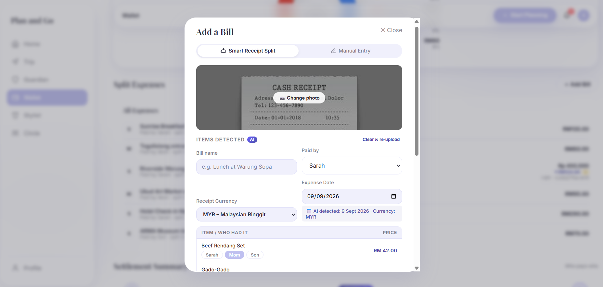  
*Users can upload receipt images using the "Smart Receipt Split" feature, which uses AI to automatically parse items, prices, dates, and currencies. From this modal, users can assign individual line items to specific members and designate who paid for streamlined group expense tracking.*

### Figure 4: One-Tap SOS & Real-Time Safety Hub
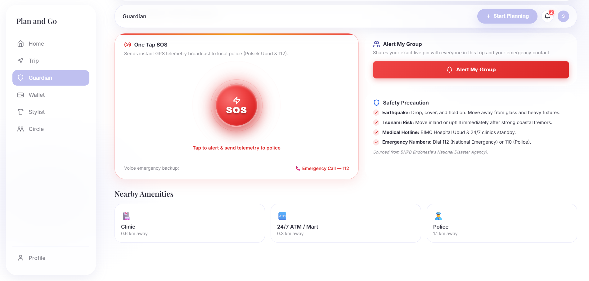  
*The Guardian dashboard provides immediate emergency support through a "One Tap SOS" feature that broadcasts live GPS telemetry to local authorities and allows users to alert group members instantly. It also aggregates localized safety guidelines, emergency hotlines, and quick-access cards for nearby critical amenities such as clinics, ATMs, and police stations.*

### Figure 5: Guardian Real-Time Group Location Tracker
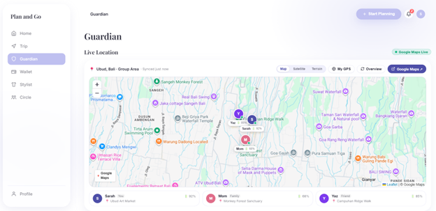  
*The Live Location map tracks group members in real time via an interactive Google Maps interface, showing each member’s precise pin, current spot, and device battery status. Users can toggle between map layers, center on their own GPS, or open external navigation to stay connected and ensure group safety during travel.*

### Figure 6: Smart Wardrobe & AI Travel Stylist
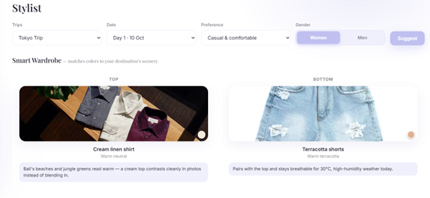  
*The Stylist feature provides personalized outfit suggestions by analyzing the user's travel date, preferred aesthetic, gender, and local climate. Under the "Smart Wardrobe" section, it pairs tops and bottoms with tailored color-palette advice that matches the destination’s scenery and ensures photogenic, weather-appropriate outfits.*

### Figure 7: Daily Check-In & Group Experience Feedback
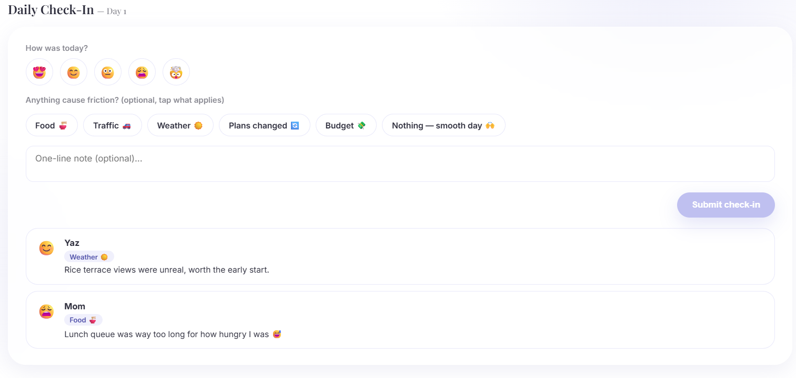  
*The Daily Check-In feature captures end-of-day travel sentiment by allowing group members to log their mood, identify friction points (such as traffic, weather, or food), and leave brief notes. This shared feedback feed helps travel companions stay attuned to everyone's travel fatigue.*

### Figure 8: AI Trip Recap & Group Harmony Analytics
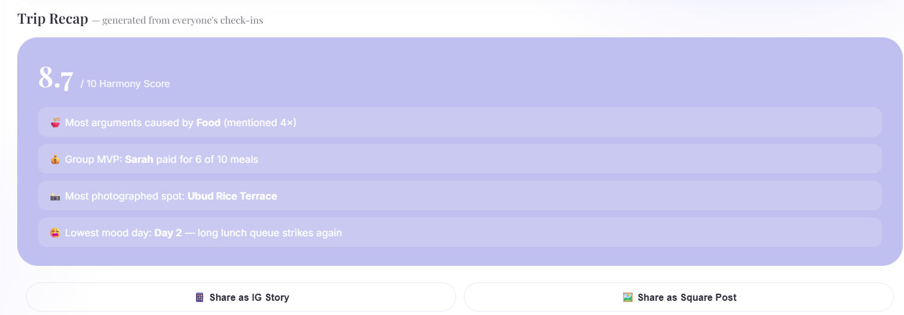  
*The Trip Recap aggregates feedback and expense data into a personalized post-trip summary, highlighting key milestones such as the "Harmony Score," group MVP, top photo spots, and recurring friction points. Users can instantly export these highlights into pre-formatted Instagram Stories or square posts for social sharing.*

---

## 4. What Makes It Different

Compared with existing travel-planning applications, **Plan&Go** differentiates itself through the following key features:

| Feature | Description |
| :--- | :--- |
| **Dynamic Contextual Adaptation** | AI automatically adjusts the itinerary when weather, delays, or other real-time conditions change, instead of requiring users to rearrange plans manually. |
| **AI Track Bills** | Scan a receipt with OCR and let each traveller select the items they consumed. |
| **Safety Hub** | Combines one-tap SOS, live group location sharing, and nearby verified 24/7 clinics, police posts, and convenience stores in one place. |
| **Receipt-Itemized Bill Splitting** | AI scans receipts and identifies individual items, allowing each traveller to simply select what they consumed instead of manually entering expenses. |
| **AI Stylist & Smart Packing** | Generates outfit and packing recommendations based on both the destination’s weather and the day’s specific activities and dress requirements. |
| **Reflective Travel Story** | Converts daily check-ins, moods, notes, and completed activities into an automated personalized travel story, rather than just a list of visited places. |

### Competitive Matrix

| Capability | Wanderlog | TripIt | Plan&Go |
| :--- | :---: | :---: | :---: |
| **Trip Planning** | ✅ | ✅ | ✅ |
| **Group Collaboration** | ✅ | ✅ | ✅ |
| **Flight/Travel Recommendations** | ✅ | ✅ | ✅ |
| **AI Dynamic Rescheduling** | ❌ | ❌ | ✅ |
| **Integrated Safety Hub** | ❌ | ❌ | ✅ |
| **Weather + AI Styling** | ❌ | ❌ | ✅ |
| **AI Travel Recap** | ❌ | ❌ | ✅ |
| **Bill Tracking & Splitting** | Basic expense tracking | ❌ | ✅ |

---

## 5. Technical Architecture & Feasibility

### 5.1 Tech Stack

| Category | Technology / Service | Purpose / Reason |
| :--- | :--- | :--- |
| **Frontend** | React + Vite Tailwind CSS Leaflet.js | Lightweight, fast-loading travel-planning interface with interactive itinerary mapping and component styling. |
| **Backend** | Python + FastAPI Docker | High-performance asynchronous API for AI orchestration, OCR pipeline, trip logic, and third-party integrations. |
| **Database** | Supabase PostgreSQL | Stores user profiles, trips, itineraries, expenses and daily check-ins; provides free-tier database and authentication. |
| **ExchangeRate API** | ExchangeRate-API | Real-time currency conversion for multi-currency expense tracking and budget calculations. |
| **AI Services** | Gemini / OpenAI API | Personalised itinerary generation and AI-powered trip recaps. |
| **Maps & Services** | Google Maps Platform | Maps, routes and nearby places. |
| **OCR** | Google Cloud Vision / Gemini Vision | Extracts information from uploaded receipt. |
| **Weather** | OpenWeather API | Provides weather information for trip planning and dynamic updates. |
| **Hosting** | Vercel + Render / Railway | Simple public deployment suitable for a hackathon. |

> **Technical Constraints & Mitigations:**  
> For the constraints, we expect free-tier API quotas, hosting cold starts, limited database resources and occasional AI/OCR inaccuracies. API keys will be kept server-side rather than exposed in the frontend.

### 5.2 3-Week Development Timeline

| Week | Focus | Key Tasks |
| :---: | :--- | :--- |
| **Week 1** | **Backend & Core Functions** | - Set up FastAPI backend - Connect Supabase PostgreSQL & authentication - Connect frontend and backend - Implement user profiles, trip creation and itinerary data structure - Implement basic AI itinerary generation |
| **Week 2** | **AI & API Integration** | - Integrate Google Maps & Places API - Integrate OpenWeather API - Implement dynamic itinerary updates based on weather/location - Implement shared wallet & transaction tracking - Implement receipt OCR & bill splitting |
| **Week 3** | **Recap, Integration & Development** | - Implement daily check-ins & photo uploads - Implement AI-generated travel score & recap - Complete frontend-backend integration - Error handling & accuracy testing - Deploy frontend/backend - Final testing, bug fixing & demo preparation |
